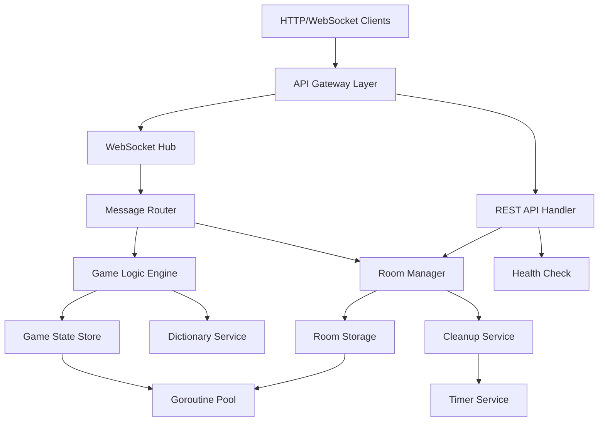

# Design Document

## Overview

The backend service is a high-performance Go application that powers real-time multiplayer competitive Wordle gameplay. Built as a single binary for Docker deployment, it provides WebSocket-based real-time communication and REST API endpoints for room management. The system manages game state in-memory, coordinates between competing players, and ensures sub-100ms latency for game updates while supporting 1000+ concurrent connections.

The architecture follows event-driven patterns with goroutine-based concurrency, providing instant feedback on opponent progress patterns (green/yellow/gray indicators) without revealing actual letter guesses, maintaining competitive tension while preserving game integrity.

## Steering Document Alignment

### Technical Standards (tech.md)

**Go Backend Standards Adherence:**
- Package organization follows documented structure with `internal/` for private packages
- Error handling uses structured patterns with proper logging
- Concurrency implemented with channels and proper mutex locking for shared state
- Testing requirements met with unit tests, integration tests, and >80% coverage
- Single responsibility principle with modular package design

**Performance Standards Compliance:**
- WebSocket message processing within 10ms target
- Memory usage <50MB per 100 concurrent games  
- CPU usage <5% during normal operation
- Support for 1000+ concurrent WebSocket connections
- Sub-100ms REST API response times

**Security Guidelines Implementation:**
- Input validation and sanitization on all endpoints
- Rate limiting for WebSocket messages and REST API calls
- Origin validation for WebSocket connections
- No persistent storage of sensitive data
- Proper CORS configuration

### Project Structure (structure.md)

**Directory Structure Adherence:**
- `/backend/internal/` packages for game, room, ws, api, and config modules
- Embedded static assets in `/backend/assets/words/` for dictionary files
- Clean separation between WebSocket hub, game logic, and room management
- Configuration management via environment variables following documented patterns

**Development Workflow Alignment:**
- Structured logging in JSON format for operational monitoring
- Health check endpoint for container orchestration
- Graceful shutdown handling with proper resource cleanup
- Cross-compilation support for Docker deployment

## Code Reuse Analysis

### Existing Components to Leverage
- **Container Infrastructure**: Existing Docker configuration and deployment patterns from current setup
- **Git Workflow**: Established branching strategy and commit message conventions
- **CI/CD Pipeline**: GitHub Actions workflows for build, test, and release processes

### Integration Points
- **Docker Environment**: Single container deployment matching established patterns
- **Port Configuration**: Standard port 8080 for HTTP/WebSocket traffic
- **Environment Variables**: Configuration following documented naming conventions
- **Health Monitoring**: Integration with existing health check and monitoring infrastructure

## Architecture

The system implements a hub-and-spoke architecture with goroutine-based concurrency for handling real-time multiplayer interactions. The design separates concerns across distinct packages while maintaining high performance through in-memory state management and efficient WebSocket communication.

### Modular Design Principles
- **Single Package Responsibility**: Each internal package handles one specific domain (game logic, WebSocket management, room lifecycle, API endpoints)
- **Component Isolation**: Game state, WebSocket hub, and room management operate independently with clean interfaces
- **Service Layer Separation**: Clear boundaries between transport layer (WebSocket/HTTP), business logic (game rules), and data layer (in-memory storage)
- **Utility Modularity**: Dictionary management, validation, and cleanup utilities as focused, single-purpose modules



## Components and Interfaces

### WebSocket Hub (ws package)
- **Purpose:** Manages persistent connections, broadcasts messages, and routes client communications
- **Interfaces:** 
  - `Hub.Register(client *Client)` - Add new client connection
  - `Hub.Unregister(client *Client)` - Remove client and cleanup
  - `Hub.Broadcast(roomID string, message []byte)` - Send message to room participants
- **Dependencies:** Room Manager for client-room association, Message handlers for processing
- **Reuses:** Standard gorilla/websocket library, structured logging patterns

### Game Logic Engine (game package)
- **Purpose:** Core Wordle game mechanics, word validation, and scoring computation
- **Interfaces:**
  - `Game.ProcessGuess(playerID, word string) (*GuessResult, error)` - Validate and score guess
  - `Game.GetState() *GameState` - Return current game state for all players
  - `Game.IsComplete() (bool, string)` - Check for game completion and winner
- **Dependencies:** Dictionary Service for word validation, synchronized state access
- **Reuses:** Embedded word lists, existing validation patterns

### Room Manager (room package)  
- **Purpose:** Room lifecycle management, player coordination, and automatic cleanup
- **Interfaces:**
  - `Manager.CreateRoom() (*Room, error)` - Generate new room with unique code
  - `Manager.JoinRoom(roomID, playerID string) error` - Add player to existing room
  - `Manager.GetRoom(roomID string) (*Room, bool)` - Retrieve room state
  - `Manager.CleanupExpired()` - Remove inactive rooms
- **Dependencies:** Game Logic Engine for game state initialization, Cleanup Service for timers
- **Reuses:** Unique ID generation utilities, structured error handling

### REST API Handler (api package)
- **Purpose:** HTTP endpoints for room operations, health checks, and CORS handling
- **Interfaces:**
  - `POST /api/rooms` - Create new room, return room code
  - `GET /api/rooms/{id}` - Get room status and player count  
  - `GET /health` - System health and metrics
- **Dependencies:** Room Manager for room operations, middleware for CORS/logging
- **Reuses:** gorilla/mux router, rs/cors middleware, standard HTTP patterns

### Dictionary Service (game package)
- **Purpose:** Word list management, validation, and random target selection
- **Interfaces:**
  - `Dictionary.IsValidGuess(word string) bool` - Check if word acceptable for guessing
  - `Dictionary.GetRandomTarget() string` - Select random target word from curated list
  - `Dictionary.LoadWordLists() error` - Initialize embedded dictionaries
- **Dependencies:** Embedded asset files, logging utilities
- **Reuses:** Standard file embedding patterns, error handling conventions

## Data Models

### Game State Model
```go
type GameState struct {
    mu          sync.RWMutex
    RoomID      string                 `json:"roomId"`
    TargetWord  string                 `json:"-"` // Never serialized to clients
    Players     map[string]*Player     `json:"players"`
    Status      GameStatus             `json:"status"` // waiting, playing, completed
    Winner      string                 `json:"winner,omitempty"`
    StartTime   time.Time              `json:"startTime"`
    EndTime     *time.Time             `json:"endTime,omitempty"`
}

type Player struct {
    ID       string      `json:"id"`
    Guesses  []Guess     `json:"guesses"`
    Status   PlayerStatus `json:"status"` // active, winner, eliminated, disconnected
    LastSeen time.Time   `json:"lastSeen"`
}

type Guess struct {
    Word      string      `json:"word"`
    Results   []LetterResult `json:"results"`
    Timestamp time.Time   `json:"timestamp"`
}

type LetterResult struct {
    Letter string `json:"letter"`
    Status string `json:"status"` // correct, present, absent
}
```

### Room Model
```go
type Room struct {
    mu        sync.RWMutex
    ID        string           `json:"id"`
    Code      string           `json:"code"` // 6-character alphanumeric
    Game      *GameState       `json:"game"`
    Clients   map[string]*Client `json:"-"` // WebSocket connections
    Created   time.Time        `json:"created"`
    LastActivity time.Time     `json:"lastActivity"`
    MaxPlayers   int            `json:"maxPlayers"`
}
```

### WebSocket Message Model
```go
type Message struct {
    Type      string      `json:"type"` // join, guess, status, error, gameUpdate
    RoomID    string      `json:"roomId,omitempty"`
    PlayerID  string      `json:"playerId,omitempty"`
    Data      interface{} `json:"data,omitempty"`
    Timestamp time.Time   `json:"timestamp"`
}

type GuessMessage struct {
    Word string `json:"word"`
}

type GameUpdateMessage struct {
    GameState    *GameState `json:"gameState"`
    PlayerUpdate *Player    `json:"playerUpdate,omitempty"`
}
```

## Error Handling

### Error Scenarios
1. **Invalid Word Submission**
   - **Handling:** Return structured error without consuming guess attempt
   - **User Impact:** Clear message "Word not in dictionary" with guess counter unchanged

2. **Room Full/Not Found**
   - **Handling:** HTTP 400/404 with specific error code and message
   - **User Impact:** Redirect to room creation with helpful error explanation

3. **WebSocket Connection Loss** 
   - **Handling:** Graceful cleanup, notify remaining players, offer reconnection
   - **User Impact:** Connection status indicator, automatic reconnection attempts

4. **Game State Corruption**
   - **Handling:** Log error, reset game state, notify players of restart requirement
   - **User Impact:** Clear notification of technical issue with option to create new room

5. **Rate Limit Exceeded**
   - **Handling:** Temporary connection suspension with exponential backoff
   - **User Impact:** Brief "slow down" message with retry indication

6. **Memory/Resource Exhaustion**
   - **Handling:** Reject new rooms, accelerate cleanup, log resource metrics
   - **User Impact:** "Server busy" message with retry suggestion

## Testing Strategy

### Unit Testing
- **Game Logic Package:** Test word validation, scoring algorithms, game state transitions
- **Room Management:** Test room creation, joining, expiration logic
- **Dictionary Service:** Test word list loading, validation, random selection
- **Message Processing:** Test WebSocket message parsing and routing
- **API Endpoints:** Test request/response handling, error cases
