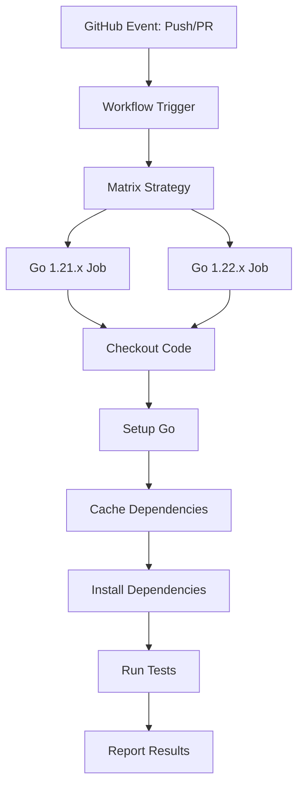

# Design Document

## Overview

This design document outlines the implementation of a GitHub Actions workflow to automatically run Go tests for the Worduel backend project. The workflow will be triggered on pushes and pull requests, running tests across multiple Go versions to ensure compatibility and code quality.

## Steering Document Alignment

### Technical Standards (tech.md)
The design follows standard GitHub Actions patterns and Go testing conventions, using official actions and established CI/CD practices.

### Project Structure (structure.md)
The workflow will be placed in the standard `.github/workflows/` directory following GitHub's conventions for repository automation.

## Code Reuse Analysis

### Existing Components to Leverage
- **Go test framework**: Existing test files in `backend/internal/game/` will be executed
- **Go modules**: Existing `go.mod` and `go.sum` files for dependency management
- **Test structure**: Current test files (`*_test.go`) follow Go testing conventions

### Integration Points
- **GitHub repository**: Workflow will integrate with GitHub's PR and push events
- **Go toolchain**: Will use Go's built-in testing commands and module system
- **Backend directory**: Tests will run from the `backend/` subdirectory

## Architecture

The GitHub Actions workflow follows a matrix strategy pattern to test across multiple Go versions efficiently. The workflow uses official GitHub Actions for consistency and security.

### Modular Design Principles
- **Single File Responsibility**: One workflow file dedicated solely to running tests
- **Component Isolation**: Separate jobs for different Go versions using matrix strategy
- **Service Layer Separation**: Clear separation between setup, dependency installation, and test execution
- **Utility Modularity**: Reusable steps that can be extended for future workflows



## Components and Interfaces

### Workflow File
- **Purpose:** Define the CI/CD pipeline for automated testing
- **Location:** `.github/workflows/test.yml`
- **Triggers:** Push to any branch, pull request events
- **Dependencies:** GitHub Actions marketplace actions
- **Reuses:** Standard GitHub Actions (actions/checkout, actions/setup-go, actions/cache)

### Matrix Strategy
- **Purpose:** Run tests across multiple Go versions simultaneously
- **Interfaces:** Matrix variables for Go version configuration
- **Dependencies:** GitHub Actions matrix feature
- **Reuses:** Official setup-go action with version matrix

### Test Execution Steps
- **Purpose:** Execute Go tests with proper configuration
- **Interfaces:** Standard Go testing commands and flags
- **Dependencies:** Go toolchain, project dependencies
- **Reuses:** Existing test files and Go module configuration

## Data Models

### Workflow Configuration
```yaml
name: Tests
on: [push, pull_request]
jobs:
  test:
    strategy:
      matrix:
        go-version: [1.21.x, 1.22.x]
    runs-on: ubuntu-latest
    steps:
      - uses: actions/checkout@v4
      - uses: actions/setup-go@v5
      - run: go test ./...
```

### Matrix Variables
```yaml
matrix:
  go-version: [1.21.x, 1.22.x]
  os: [ubuntu-latest]  # Can be extended for cross-platform testing
```

## Error Handling

### Error Scenarios
1. **Go Module Download Failure:**
   - **Handling:** Retry mechanism with exponential backoff
   - **User Impact:** Clear error message indicating network or dependency issues

2. **Test Compilation Failure:**
   - **Handling:** Display full compilation errors with file locations
   - **User Impact:** Detailed compiler output for debugging

3. **Test Execution Failure:**
   - **Handling:** Show failing test output with stack traces
   - **User Impact:** Specific test failure information for quick resolution

4. **Cache Corruption:**
   - **Handling:** Fallback to clean dependency installation
   - **User Impact:** Slightly longer build time but continued execution

## Testing Strategy

### Unit Testing
- Execute existing Go unit tests in `backend/internal/game/` directory
- Use `go test -v ./...` for verbose output and comprehensive coverage
- Run tests with race detection enabled: `go test -race ./...`

### Integration Testing
- Tests will run against the full module dependency tree
- Validate that all imports and module relationships work correctly
- Ensure tests pass in clean environment (no local development dependencies)

### End-to-End Testing
- Workflow execution tests via GitHub Actions interface
- Validate that workflow triggers correctly on push and PR events
- Verify that test results are properly reported in GitHub UI

## Performance Optimizations

### Caching Strategy
- **Go Module Cache:** Cache `~/go/pkg/mod` to speed up dependency downloads
- **Build Cache:** Cache Go build artifacts to reduce compilation time
- **Cache Key:** Based on `go.sum` file hash for automatic invalidation

### Parallel Execution
- Matrix strategy runs Go versions in parallel
- Each job runs on separate runner instances
- Test packages can run concurrently within each job

### Resource Management
- Use `ubuntu-latest` runners for cost efficiency and performance
- Limit workflow to essential steps to minimize execution time
- Set appropriate timeouts to prevent hung workflows